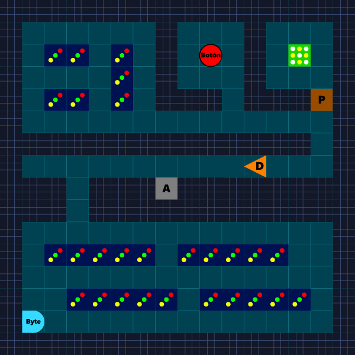
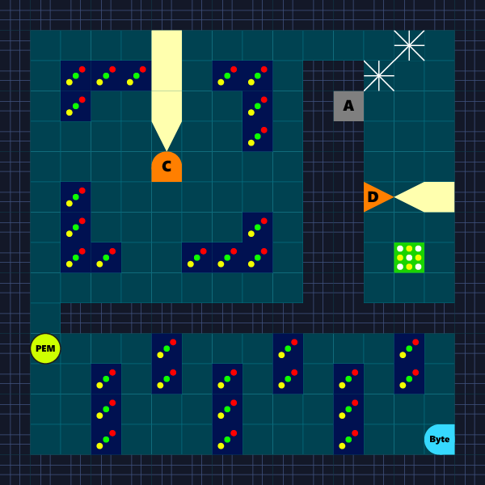
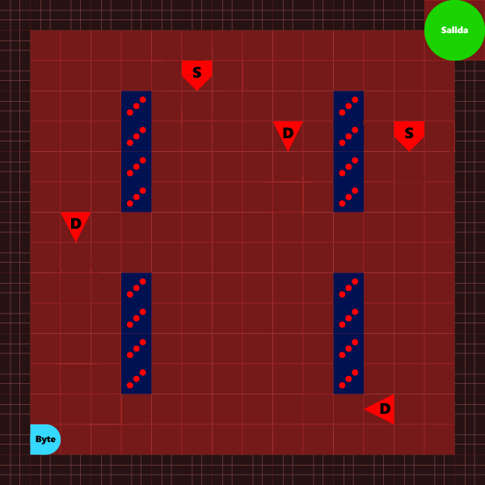

# ByteMan 

## Equipo de desarrollo

- Gonzalo Álvarez
- Pablo Gilman
- Rodrigo Domingorena

## Reglas / Instrucciones

Es un juego perteneciente a los géneros de sigilo, infiltración y supervivencia en grilla. En principio, el alcance del desarrollo será de 3 niveles con un tablero/pantalla estática.

### 1. Concepto general

El jugador controla a *ByteMan*, un extractor de datos independiente. El objetivo es infiltrarse en los servidores físicos de la corporación "NexCorp" para robar información clasificada, evadiendo al sistema de seguridad automatizado *Argus*.

### 2. ¿Qué son el sigilo y los estados?

El sigilo no es más que una asimetría de información, en donde el jugador ve todo el tablero y sabe dónde están los enemigos que forman parte de *Argus*. Tales enemigos, en cambio, tienen información limitada y no saben dónde está el jugador hasta que entra en su rango predefinido ("campo de visión").

* **Estado de Sigilo:** Es el estado por defecto de cada enemigo. En él, patrulla y/o vigila de modo predefinido el tablero para detectar un posible infiltrado.

* **Estado de Alarma:** Cuando un enemigo detecta al infiltrado, entra individualmente en este estado y lo persigue de forma activa. Es un estado propio de cada enemigo, no algo que se contagie al resto del sistema Argus: mientras uno persigue, los demás pueden seguir patrullando tranquilos hasta detectarlo por su cuenta.

### 3. *ByteMan*

> Avatar preliminar para representar a *ByteMan*

   

El personaje principal se mueve de a una celda a la vez utilizando las flechas direccionales.

### 4. El sistema de seguridad Argus

Es un sistema automatizado que resguarda la seguridad de "NexCorp". Su principal función es patrullar las instalaciones de la empresa y, de ser necesario, perseguir y atrapar a cualquier infiltrado en ellas.

* ##### **Dron** 

       

    Patrulla en línea recta sobre un mismo eje, invirtiendo su dirección al chocar con algún límite. Tiene un campo de visión de 2 celdas.

* ##### **Cámara de Seguridad** 

       
    
    Es estática, pero rota sobre su eje 90 grados cada cierto intervalo de tiempo. Tiene un campo de visión de 4 celdas. No persigue al infiltrado directamente: si lo detecta, invoca a un Sabueso Cibernético cerca de su posición para que se encargue de perseguirlo.

* ##### **Sabueso Cibernético**

       

    Patrulla de forma errática, moviéndose de a una celda por vez de forma aleatoria. Cuando persigue, lo hace de forma inteligente hasta dar con su objetivo. Tiene un campo de visión de 1 celda en cada dirección a la vez.

### 5. Elementos del entorno y el Base de Datos.

Son los elementos que conforman y están presentes en las instalaciones de la empresa, particularmente el **Base de Datos**, el objetivo principal de *ByteMan*.

* ##### **Baldosa** 

    
    
    Es atravesable. Representa el espacio vacío por donde se pueden desplazar tanto *ByteMan* como sus enemigos. Su imagen queda fija según el estado del nivel al iniciar.

* ##### **Muro** 
    
    
    
    No es atravesable. Delimita los ambientes dentro de las instalaciones, así como también el interior del exterior del tablero.

* ##### **Rack de Servidores**    

    
    
    No es atravesable. Son los servidores de "NexCorp".

* ##### **Armario de Mantenimiento**
    
     

    Es atravesable; si *ByteMan* lo atraviesa, se oculta automáticamente dentro de él. Cuando está oculto, sus enemigos no pueden detectarlo.

* ##### **Cables pelados**
    
    
    
    Es atravesable; si *ByteMan* lo atraviesa, se produce un ruido de cortocicuito que alerta al Dron cercano (las Cámaras y los Sabuesos no reaccionan a este ruido), el cual se dirije hacia la zona para investigarlo. Cada cable solo puede activarse una vez.

* ##### **Puerta Blindada** 
    
     
    
    Posee estado, el cual puede ser abierto o cerrado. Si está abierta, es atravesable. Sirve como seguridad extra para resguardar al **Base de Datos** de un posible infiltrado.

* ##### **Botón de Hackeo**

     
    
    Es atravesable; si *ByteMan* lo atraviesa, lo presiona. Sirve para abrir o cerrar la **Puerta Blindada**.

* ##### **Base de Datos**

    
  
    Es atravesable; si *ByteMan* lo atraviesa, se queda con él y gana el nivel del juego.

### 6. Niveles

#### 6.1. Nivel 1: La Infiltración

> Vista preliminar de una posible disposición del Nivel 1

En este nivel, el jugador aprende orgánicamente a moverse interactuando con el mapa, sin necesidad de explicaciones en texto.

* **Acto 1:** *ByteMan* aparecerá en una sala cerrada rodeada de obstáculos sólidos (los Muros y Racks de Servidores). El jugador intentará moverse y al chocar asimilará la restricción de la grilla.
* **Acto 2:** *ByteMan* saldrá hacia un pasillo largo y verá a un Dron patrullando. Al no tener espacio físico para rodearlo, el jugador se verá forzado a entrar a un Armario de Mantenimiento, esperará a que el Dron pase de largo, saldrá por su espalda y avanzará.
* **Acto 3:** Al final del pasillo, la llegada al Base de Datos (la meta) estará bloqueada por una Puerta Blindada cerrada. El jugador deberá desviarse por una habitación adyacente, pisará el Botón de Hackeo para cambiar el estado de la puerta, volverá sobre sus pasos y alcanzará la meta.

#### 6.2. Nivel 2: El Núcleo de Datos

> Vista preliminar de una posible disposición del Nivel 2

En este nivel, el entorno exigirá dominar los tiempos y utilizar consumibles del inventario.

* **Acto 1:** *ByteMan* aparecerá en una sala segura. En la única ruta de salida habrá un objeto brillante en el piso (el PEM). El jugador lo recolectará pisándolo.
* **Acto 2:** *ByteMan* entrará a un salón abierto vigilado por una Cámara de Seguridad central. El jugador deberá observar el patrón de rotación para moverse de cobertura en cobertura, o decidir usar su PEM para desactivar la cámara 5 segundos y cruzar.
* **Acto 3:** En el último pasillo hacia la meta, el piso estará cubierto de Cables Pelados inevitables y un Dron vigilará la zona cercana. Al pisar los cables, el Dron abandonará su patrullaje. *ByteMan* deberá correr a un Armario cercano, dejar que el Dron investigue el ruido y aprovechar que el camino hacia el Base de Datos quedó despejado.

#### 6.3. Nivel 3: El Protocolo de Purga

> Vista preliminar de una posible disposición del Nivel 3

En este nivel, el paradigma del juego se invertirá: ya no habrá sigilo, solo supervivencia y gestión rápida de recursos en un entorno hostil.

*ByteMan* arrancará en el centro de una arena abierta. Luego de haberse robado las Bases de Datos en los niveles anteriores, este iniciará forzosamente en **Estado de Alarma**. El jugador divisará el Punto de Extracción en el extremo opuesto, pero en el medio, los Drones y Sabuesos del mapa estarán convergiendo hacia su posición para atraparlo.

El jugador tendrá libertad táctica para decidir en qué momento crítico usará su Virus Troyano para eliminar a un enemigo que le corte el paso, y cuándo detonará el PEM para paralizar a una oleada y ganar terreno.

Si logra llegar hasta el Punto de Extracción del otro extremo sin ser atrapado, el jugador ganará el nivel y el juego.

## Otros

- Programación con Objetos I, comisión 4, Universidad Nacional de Quilmes.
- Versión de Wollok:
- Una vez terminado, no tenemos problemas en que el repositorio sea público / queremos manternerlo privado.